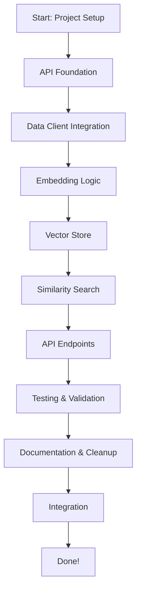

# cortex_engine Development Workflow

This document outlines the recommended workflow for developing the `cortex_engine` module, based on the class/function-level TODO list.

---

## 1. Project Setup
- Ensure all dependencies are listed in `requirements.txt` (e.g., fastapi, httpx, numpy, scikit-learn, etc.).
- Set up a virtual environment and install dependencies.

---

## 2. API Foundation
- Implement a minimal FastAPI app in `src/main.py` with a health check endpoint.
- Add basic project structure and verify the app runs.

---

## 3. Data Client Integration
- Implement `DataFoundationClient` in `src/data_client.py` to fetch reports from the Data Foundation API.
- Test fetching data using this client (unit test or script).

---

## 4. Embedding Logic
- Implement `EmbeddingGenerator` in `src/embedding.py`:
  - `load_model()` to load or initialize the embedding model.
  - `generate_embeddings(data)` to convert input data to vectors.
- Write a test for embedding generation.

---

## 5. Vector Store
- Implement `VectorStore` in `src/vector_store.py`:
  - `add_vectors(vectors, metadata)` to store vectors.
  - `search(query_vector, top_k)` for nearest neighbor search.
  - `save()` and `load()` for persistence (optional for prototype).
- Write a test for vector storage and retrieval.

---

## 6. Similarity Search
- Implement `compute_similarity(vec1, vec2)` in `src/similarity.py`.
- Implement `SimilaritySearch` class with:
  - `search(query, top_k)` to find similar items.
  - `rag_query(query)` for retrieval-augmented generation (optional at first).
- Write a test for similarity search.

---

## 7. API Endpoints
- In `src/main.py`, implement:
  - `/embed` endpoint (calls embedding logic).
  - `/similarity-search` endpoint (calls vector store and similarity logic).
  - `/rag-query` endpoint (calls RAG logic, optional at first).
- Write API tests for each endpoint.

---

## 8. Testing & Validation
- Write and run tests in `src/tests/` for:
  - Embedding generation
  - Similarity search
  - API endpoints
- Ensure all tests pass and endpoints behave as expected.

---

## 9. Documentation & Cleanup
- Update `README.md` with usage instructions and API documentation.
- Clean up code, add comments, and ensure maintainability.

---

## 10. Integration
- Test integration with the Data Foundation API (Module 1).
- Optionally, test integration with the Backend Gateway and Frontend UI as described in your API interaction table.

---

## Visual Workflow Diagram

