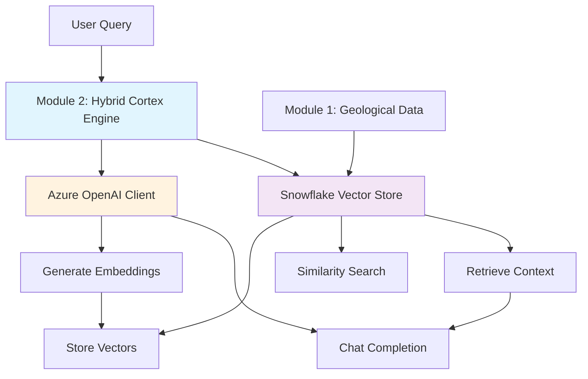

# Azure OpenAI + Snowflake Hybrid Implementation Guide

## 📋 Document Overview

This document provides a comprehensive guide for implementing a hybrid architecture that uses **Azure OpenAI for embeddings and chat** while leveraging **Snowflake for vector storage and similarity search**. This approach combines the best of both platforms for optimal performance and cost efficiency.

---

## 🎯 Architecture Overview

### **Hybrid Architecture Pattern**



### **Data Flow Diagram**

```
📊 Geological Data (Module 1) 
    ↓
🤖 Azure OpenAI Embeddings Generation
    ↓  
🏔️ Snowflake Vector Storage
    ↓
🔍 Snowflake Similarity Search
    ↓
💬 Azure OpenAI Chat Response
    ↓
📱 API Response to User
```

---

## 📁 Directory Structure

### **Enhanced Module 2 Structure**

```
cortex_engine/
├── src/
│   ├── __init__.py
│   ├── main.py                          # 🆕 Updated FastAPI with hybrid endpoints
│   ├── config.py                        # Azure OpenAI + Snowflake configuration
│   │
│   ├── hybrid/                          # 🆕 Hybrid implementation modules
│   │   ├── __init__.py
│   │   ├── azure_client.py              # 🆕 Azure OpenAI client wrapper
│   │   ├── snowflake_vectors.py         # 🆕 Snowflake vector operations
│   │   ├── hybrid_service.py            # 🆕 Main hybrid service orchestrator
│   │   └── workflow_manager.py          # 🆕 End-to-end workflow management
│   │
│   ├── models/                          # 🆕 Enhanced data models
│   │   ├── __init__.py
│   │   ├── requests.py                  # API request models
│   │   ├── responses.py                 # API response models
│   │   └── vector_models.py             # 🆕 Vector and embedding models
│   │
│   ├── database/                        # 🆕 Database integration
│   │   ├── __init__.py
│   │   ├── snowflake_connection.py      # 🆕 Snowflake connection management
│   │   └── vector_schema.py             # 🆕 Vector table schemas and migrations
│   │
│   ├── services/                        # 🆕 Service layer
│   │   ├── __init__.py
│   │   ├── embedding_service.py         # 🆕 Embedding generation service
│   │   ├── search_service.py            # 🆕 Vector search service
│   │   └── rag_service.py               # 🆕 RAG pipeline service
│   │
│   ├── utils/                           # Utility functions
│   │   ├── __init__.py
│   │   ├── vector_utils.py              # 🆕 Vector manipulation utilities
│   │   └── data_processing.py           # 🆕 Data preprocessing utilities
│   │
│   └── legacy/                          # 🆕 Previous implementation (backup)
│       ├── embedding.py                 # Original Azure OpenAI implementation
│       ├── vector_store.py              # Original in-memory vector store
│       └── similarity.py                # Original similarity search
│
├── scripts/                             # 🆕 Automation and setup scripts
│   ├── setup_snowflake_schema.py       # 🆕 Initialize Snowflake vector tables
│   ├── migrate_to_hybrid.py            # 🆕 Migration from old to hybrid system
│   ├── bulk_embedding_processor.py     # 🆕 Batch process geological data
│   └── performance_tester.py           # 🆕 Performance testing suite
│
├── sql/                                 # 🆕 SQL scripts and migrations
│   ├── schema/
│   │   ├── 001_create_vector_tables.sql # 🆕 Vector storage tables
│   │   ├── 002_create_indexes.sql       # 🆕 Vector similarity indexes
│   │   └── 003_sample_data.sql          # 🆕 Sample data for testing
│   └── queries/
│       ├── similarity_search.sql        # 🆕 Vector search queries
│       └── performance_queries.sql      # 🆕 Performance monitoring queries
│
├── tests/                               # Enhanced testing
│   ├── __init__.py
│   ├── test_hybrid_service.py           # 🆕 Hybrid service tests
│   ├── test_azure_integration.py        # 🆕 Azure OpenAI integration tests
│   ├── test_snowflake_vectors.py        # 🆕 Snowflake vector tests
│   ├── test_performance.py              # 🆕 Performance benchmarks
│   └── test_end_to_end.py               # 🆕 Complete workflow tests
│
├── docs/                                # Enhanced documentation
│   ├── api_reference.md                 # 🆕 Complete API documentation
│   ├── deployment_guide.md              # 🆕 Deployment instructions
│   └── troubleshooting.md               # 🆕 Common issues and solutions
│
├── config/                              # 🆕 Configuration files
│   ├── development.env                  # 🆕 Development environment config
│   ├── production.env.example           # 🆕 Production config template
│   └── hybrid_config.yaml              # 🆕 Hybrid system configuration
│
├── requirements.txt                     # Updated dependencies
├── requirements-dev.txt                 # 🆕 Development dependencies
├── docker-compose.yml                   # 🆕 Docker setup for development
└── README.md                           # Updated documentation
```

---

## 🚀 Implementation Guide

### **Step 1: Simple Vector Storage Setup**

#### **1.1 Snowflake Vector Tables**

```sql
-- sql/schema/001_create_vector_tables.sql
-- Simple vector storage table
CREATE TABLE IF NOT EXISTS azure_embeddings (
    id VARCHAR PRIMARY KEY,
    source_text TEXT NOT NULL,
    embedding_vector VECTOR(FLOAT, 1536),  -- Azure OpenAI ada-002 dimensions
    metadata VARIANT,
    created_at TIMESTAMP DEFAULT CURRENT_TIMESTAMP()
);

-- Geological-specific embeddings table
CREATE TABLE IF NOT EXISTS geological_embeddings (
    report_id VARCHAR PRIMARY KEY,
    title VARCHAR,
    description TEXT,
    commodities VARCHAR,
    embedding_vector VECTOR(FLOAT, 1536),
    report_metadata VARIANT,
    created_at TIMESTAMP DEFAULT CURRENT_TIMESTAMP()
);
```

#### **1.2 Basic Azure OpenAI Client**

```python
# src/hybrid/azure_client.py
import os
import json
from typing import List
from openai import AzureOpenAI
from dotenv import load_dotenv

load_dotenv()

class SimpleAzureClient:
    """Simple Azure OpenAI client for embeddings and chat"""
    
    def __init__(self):
        self.client = AzureOpenAI(
            azure_endpoint=os.getenv("AZURE_OPENAI_ENDPOINT"),
            api_key=os.getenv("AZURE_OPENAI_API_KEY"),
            api_version=os.getenv("AZURE_OPENAI_API_VERSION", "2024-02-01")
        )
        self.embedding_model = os.getenv("EMBEDDING_MODEL", "text-embedding-ada-002")
        self.chat_model = os.getenv("CHAT_MODEL", "gpt-4o-mini")
    
    def generate_embedding(self, text: str) -> List[float]:
        """Generate a single embedding"""
        try:
            response = self.client.embeddings.create(
                input=[text],
                model=self.embedding_model
            )
            return response.data[0].embedding
        except Exception as e:
            raise RuntimeError(f"Failed to generate embedding: {e}")
    
    def generate_embeddings(self, texts: List[str]) -> List[List[float]]:
        """Generate multiple embeddings"""
        try:
            response = self.client.embeddings.create(
                input=texts,
                model=self.embedding_model
            )
            return [item.embedding for item in response.data]
        except Exception as e:
            raise RuntimeError(f"Failed to generate embeddings: {e}")
    
    def chat_completion(self, messages: List[dict]) -> str:
        """Generate chat completion"""
        try:
            response = self.client.chat.completions.create(
                model=self.chat_model,
                messages=messages,
                max_tokens=500,
                temperature=0.7
            )
            return response.choices[0].message.content
        except Exception as e:
            raise RuntimeError(f"Failed to generate chat completion: {e}")
```

#### **1.3 Basic Snowflake Vector Operations**

```python
# src/hybrid/snowflake_vectors.py
import json
from typing import List, Dict, Any, Optional
import sys
from pathlib import Path

# Add data foundation project to path
sys.path.append(str(Path(__file__).parent.parent.parent.parent / "data_foundation_project"))
from src.snowflake_client import snowflake_client

class SimpleSnowflakeVectors:
    """Simple Snowflake vector operations"""
    
    def __init__(self):
        self.client = snowflake_client
    
    async def store_embedding(
        self, 
        id: str, 
        text: str, 
        embedding: List[float], 
        metadata: Optional[Dict] = None
    ) -> bool:
        """Store a single embedding in Snowflake"""
        try:
            query = """
            INSERT INTO azure_embeddings (id, source_text, embedding_vector, metadata)
            VALUES (?, ?, PARSE_JSON(?), PARSE_JSON(?))
            """
            
            await self.client.execute_query(query, [
                id,
                text,
                json.dumps(embedding),
                json.dumps(metadata or {})
            ])
            return True
        except Exception as e:
            print(f"Failed to store embedding: {e}")
            return False
    
    async def search_similar(
        self, 
        query_embedding: List[float], 
        top_k: int = 5,
        threshold: float = 0.7
    ) -> List[Dict[str, Any]]:
        """Search for similar embeddings"""
        try:
            query = """
            SELECT 
                id,
                source_text,
                metadata,
                VECTOR_COSINE_SIMILARITY(embedding_vector, PARSE_JSON(?)) as similarity
            FROM azure_embeddings
            WHERE VECTOR_COSINE_SIMILARITY(embedding_vector, PARSE_JSON(?)) >= ?
            ORDER BY similarity DESC
            LIMIT ?
            """
            
            query_vector_json = json.dumps(query_embedding)
            results = await self.client.execute_query(query, [
                query_vector_json, query_vector_json, threshold, top_k
            ])
            
            return results
        except Exception as e:
            print(f"Failed to search similar embeddings: {e}")
            return []
```

### **Step 2: Simple Hybrid Service**

```python
# src/hybrid/hybrid_service.py
from typing import List, Dict, Any
from .azure_client import SimpleAzureClient
from .snowflake_vectors import SimpleSnowflakeVectors

class SimpleHybridService:
    """Simple hybrid service combining Azure OpenAI + Snowflake"""
    
    def __init__(self):
        self.azure_client = SimpleAzureClient()
        self.snowflake_vectors = SimpleSnowflakeVectors()
    
    async def embed_and_store(self, text: str, id: str = None, metadata: Dict = None) -> Dict[str, Any]:
        """Simple workflow: generate embedding and store in Snowflake"""
        
        # Step 1: Generate embedding with Azure OpenAI
        print(f"🤖 Generating embedding for: {text[:50]}...")
        embedding = self.azure_client.generate_embedding(text)
        
        # Step 2: Store in Snowflake
        record_id = id or f"embed_{hash(text)}"
        print(f"🏔️ Storing embedding in Snowflake with ID: {record_id}")
        
        success = await self.snowflake_vectors.store_embedding(
            id=record_id,
            text=text,
            embedding=embedding,
            metadata=metadata
        )
        
        return {
            "success": success,
            "id": record_id,
            "embedding_dimensions": len(embedding),
            "text_preview": text[:100]
        }
    
    async def search_and_chat(self, query: str, top_k: int = 3) -> Dict[str, Any]:
        """Simple workflow: search similar + generate chat response"""
        
        # Step 1: Generate query embedding
        print(f"🔍 Searching for: {query}")
        query_embedding = self.azure_client.generate_embedding(query)
        
        # Step 2: Find similar embeddings in Snowflake
        similar_results = await self.snowflake_vectors.search_similar(
            query_embedding=query_embedding,
            top_k=top_k
        )
        
        if not similar_results:
            return {"message": "No similar content found", "results": []}
        
        # Step 3: Prepare context for chat
        context_texts = [result['source_text'] for result in similar_results]
        context = "\n".join(context_texts)
        
        # Step 4: Generate chat response
        messages = [
            {"role": "system", "content": "You are a helpful assistant analyzing geological data."},
            {"role": "user", "content": f"Based on this context:\n{context}\n\nAnswer: {query}"}
        ]
        
        chat_response = self.azure_client.chat_completion(messages)
        
        return {
            "query": query,
            "chat_response": chat_response,
            "context_sources": len(similar_results),
            "similar_results": similar_results
        }
```

### **Step 3: Simple API Endpoints**

```python
# src/main.py - Simple hybrid endpoints
from fastapi import FastAPI
from pydantic import BaseModel
from typing import Optional, Dict, Any
from .hybrid.hybrid_service import SimpleHybridService

app = FastAPI(title="Simple Hybrid Cortex Engine")

# Initialize service
hybrid_service = SimpleHybridService()

class EmbedRequest(BaseModel):
    text: str
    id: Optional[str] = None
    metadata: Optional[Dict[str, Any]] = None

class SearchRequest(BaseModel):
    query: str
    top_k: Optional[int] = 5

@app.post("/simple-embed")
async def simple_embed(request: EmbedRequest):
    """Simple endpoint: text → Azure embedding → Snowflake storage"""
    
    result = await hybrid_service.embed_and_store(
        text=request.text,
        id=request.id,
        metadata=request.metadata
    )
    
    return {
        "operation": "embed_and_store",
        "result": result,
        "workflow": "text → azure_openai → snowflake"
    }

@app.post("/simple-search")
async def simple_search(request: SearchRequest):
    """Simple endpoint: query → similarity search → chat response"""
    
    result = await hybrid_service.search_and_chat(
        query=request.query,
        top_k=request.top_k
    )
    
    return {
        "operation": "search_and_chat",
        "result": result,
        "workflow": "query → azure_embedding → snowflake_search → azure_chat"
    }

@app.get("/simple-test")
async def simple_test():
    """Simple test endpoint"""
    
    # Test the complete workflow
    test_text = "Geological exploration site with copper and gold deposits in Western Australia"
    
    # Step 1: Embed and store
    embed_result = await hybrid_service.embed_and_store(
        text=test_text,
        id="test_geological_site",
        metadata={"type": "test", "commodities": ["copper", "gold"]}
    )
    
    # Step 2: Search and chat
    search_result = await hybrid_service.search_and_chat(
        query="Tell me about copper mining sites",
        top_k=3
    )
    
    return {
        "test_completed": True,
        "embed_step": embed_result,
        "search_step": search_result,
        "workflow_verified": "✅ Azure OpenAI + Snowflake integration working"
    }
```

---

## 🔄 Complete Workflow Implementation

### **Step 4: Advanced Geological Data Processing**

```python
# src/services/geological_processor.py
from typing import List, Dict, Any
from ..hybrid.hybrid_service import SimpleHybridService
import sys
from pathlib import Path

# Add data foundation project path
sys.path.append(str(Path(__file__).parent.parent.parent.parent / "data_foundation_project"))
from src.snowflake_client import snowflake_client

class GeologicalProcessor:
    """Process geological data through the hybrid pipeline"""
    
    def __init__(self):
        self.hybrid_service = SimpleHybridService()
        self.snowflake_client = snowflake_client
    
    async def process_geological_reports(self, limit: int = 50) -> Dict[str, Any]:
        """Complete geological data processing workflow"""
        
        print(f"🗃️ Processing {limit} geological reports...")
        
        # Step 1: Fetch geological data from Module 1
        geological_query = """
        SELECT 
            anumber,
            title,
            target_commodities,
            operator,
            report_year,
            CONCAT(
                'Geological Report: ', title, 
                ' - Target Commodities: ', COALESCE(target_commodities, 'Unknown'),
                ' - Operator: ', COALESCE(operator, 'Unknown'),
                ' - Year: ', COALESCE(report_year::STRING, 'Unknown')
            ) as description
        FROM geological_reports 
        WHERE title IS NOT NULL 
        AND target_commodities IS NOT NULL
        LIMIT ?
        """
        
        reports = await self.snowflake_client.execute_query(geological_query, [limit])
        
        if not reports:
            return {"error": "No geological reports found"}
        
        print(f"📊 Found {len(reports)} geological reports")
        
        # Step 2: Process each report through hybrid pipeline
        processed_reports = []
        failed_reports = []
        
        for i, report in enumerate(reports):
            try:
                print(f"⚙️ Processing report {i+1}/{len(reports)}: {report['anumber']}")
                
                # Generate embedding and store in Snowflake
                result = await self.hybrid_service.embed_and_store(
                    text=report['description'],
                    id=f"geo_report_{report['anumber']}",
                    metadata={
                        "report_id": report['anumber'],
                        "title": report['title'],
                        "commodities": report['target_commodities'],
                        "operator": report['operator'],
                        "year": report['report_year'],
                        "source": "geological_reports_table"
                    }
                )
                
                if result['success']:
                    processed_reports.append({
                        "report_id": report['anumber'],
                        "title": report['title'],
                        "processed": True
                    })
                else:
                    failed_reports.append(report['anumber'])
                    
            except Exception as e:
                print(f"❌ Failed to process report {report['anumber']}: {e}")
                failed_reports.append(report['anumber'])
        
        return {
            "total_reports": len(reports),
            "processed_successfully": len(processed_reports),
            "failed_reports": len(failed_reports),
            "success_rate": len(processed_reports) / len(reports) * 100,
            "processed_reports": processed_reports[:5],  # Show first 5
            "workflow": "geological_data → azure_embeddings → snowflake_vectors"
        }
    
    async def search_geological_data(self, query: str, top_k: int = 5) -> Dict[str, Any]:
        """Search geological data using natural language"""
        
        print(f"🔍 Searching geological data for: {query}")
        
        # Use the hybrid service for search
        result = await self.hybrid_service.search_and_chat(
            query=query,
            top_k=top_k
        )
        
        # Enhanced response with geological context
        geological_context = []
        for item in result.get('similar_results', []):
            metadata = item.get('metadata', {})
            geological_context.append({
                "report_id": metadata.get('report_id'),
                "title": metadata.get('title'),
                "commodities": metadata.get('commodities'),
                "similarity_score": item.get('similarity'),
                "text_preview": item.get('source_text', '')[:150] + "..."
            })
        
        return {
            "query": query,
            "ai_response": result.get('chat_response'),
            "geological_matches": geological_context,
            "total_matches": len(geological_context),
            "search_method": "azure_embedding + snowflake_vectors"
        }
```

### **Step 5: Advanced API Endpoints**

```python
# src/main.py - Complete hybrid API
from .services.geological_processor import GeologicalProcessor

# Add geological processor
geological_processor = GeologicalProcessor()

@app.post("/process-geological-data")
async def process_geological_data(limit: int = 50):
    """Process geological reports through Azure OpenAI → Snowflake pipeline"""
    
    result = await geological_processor.process_geological_reports(limit=limit)
    
    return {
        "operation": "geological_data_processing",
        "result": result,
        "pipeline": "Module1_Data → Azure_OpenAI_Embeddings → Snowflake_Vectors"
    }

@app.post("/search-geological")
async def search_geological_data(request: SearchRequest):
    """Search geological data using natural language queries"""
    
    result = await geological_processor.search_geological_data(
        query=request.query,
        top_k=request.top_k
    )
    
    return {
        "operation": "geological_search",
        "result": result,
        "technology_stack": {
            "embeddings": "azure_openai_text-embedding-ada-002",
            "vector_storage": "snowflake_vector_tables",
            "similarity_search": "snowflake_cosine_similarity",
            "chat_completion": "azure_openai_gpt-4o-mini"
        }
    }

@app.get("/hybrid-status")
async def hybrid_status():
    """Check the status of the hybrid system"""
    
    # Test Azure OpenAI connection
    try:
        test_embedding = hybrid_service.azure_client.generate_embedding("test")
        azure_status = "✅ Connected"
        embedding_dimensions = len(test_embedding)
    except Exception as e:
        azure_status = f"❌ Error: {str(e)}"
        embedding_dimensions = 0
    
    # Test Snowflake connection
    try:
        test_query = "SELECT COUNT(*) as count FROM azure_embeddings"
        result = await hybrid_service.snowflake_vectors.client.execute_query(test_query)
        snowflake_status = "✅ Connected"
        stored_embeddings = result[0]['count'] if result else 0
    except Exception as e:
        snowflake_status = f"❌ Error: {str(e)}"
        stored_embeddings = 0
    
    return {
        "hybrid_system_status": "operational",
        "azure_openai": {
            "status": azure_status,
            "embedding_dimensions": embedding_dimensions,
            "models": {
                "embedding": hybrid_service.azure_client.embedding_model,
                "chat": hybrid_service.azure_client.chat_model
            }
        },
        "snowflake_vectors": {
            "status": snowflake_status,
            "stored_embeddings": stored_embeddings
        },
        "integration": "azure_openai + snowflake_vectors"
    }
```

---

## 🧪 Testing the Hybrid System

### **Step 6: Testing Scripts**

```python
# scripts/test_hybrid_system.py
import asyncio
import requests
import json
from pathlib import Path
import sys

# Add cortex engine to path
sys.path.append(str(Path(__file__).parent.parent))
from src.hybrid.hybrid_service import SimpleHybridService

async def test_complete_workflow():
    """Test the complete hybrid workflow"""
    
    print("🧪 Testing Azure OpenAI + Snowflake Hybrid System")
    print("=" * 60)
    
    base_url = "http://localhost:3002"
    
    # Test 1: System Status
    print("\n1️⃣ Testing System Status...")
    try:
        response = requests.get(f"{base_url}/hybrid-status")
        status = response.json()
        print(f"   ✅ System Status: {status.get('hybrid_system_status')}")
        print(f"   🤖 Azure OpenAI: {status['azure_openai']['status']}")
        print(f"   🏔️ Snowflake: {status['snowflake_vectors']['status']}")
        print(f"   📊 Stored Embeddings: {status['snowflake_vectors']['stored_embeddings']}")
    except Exception as e:
        print(f"   ❌ Status check failed: {e}")
        return False
    
    # Test 2: Simple Embedding
    print("\n2️⃣ Testing Simple Embedding...")
    try:
        test_data = {
            "text": "Gold mining exploration site in the Pilbara region of Western Australia",
            "id": "test_pilbara_gold",
            "metadata": {"region": "Pilbara", "commodity": "Gold", "test": True}
        }
        
        response = requests.post(f"{base_url}/simple-embed", json=test_data)
        result = response.json()
        
        if result['result']['success']:
            print(f"   ✅ Embedding generated and stored")
            print(f"   📏 Dimensions: {result['result']['embedding_dimensions']}")
            print(f"   🆔 ID: {result['result']['id']}")
        else:
            print(f"   ❌ Embedding failed")
            
    except Exception as e:
        print(f"   ❌ Embedding test failed: {e}")
    
    # Test 3: Search and Chat
    print("\n3️⃣ Testing Search and Chat...")
    try:
        search_data = {
            "query": "Tell me about gold mining in the Pilbara region",
            "top_k": 3
        }
        
        response = requests.post(f"{base_url}/simple-search", json=search_data)
        result = response.json()
        
        print(f"   ✅ Search completed")
        print(f"   🔍 Query: {result['result']['query']}")
        print(f"   💬 AI Response: {result['result']['chat_response'][:100]}...")
        print(f"   📊 Context Sources: {result['result']['context_sources']}")
        
    except Exception as e:
        print(f"   ❌ Search test failed: {e}")
    
    # Test 4: Geological Data Processing
    print("\n4️⃣ Testing Geological Data Processing...")
    try:
        response = requests.post(f"{base_url}/process-geological-data?limit=5")
        result = response.json()
        
        print(f"   ✅ Geological processing completed")
        print(f"   📊 Reports processed: {result['result']['processed_successfully']}")
        print(f"   📈 Success rate: {result['result']['success_rate']:.1f}%")
        
    except Exception as e:
        print(f"   ❌ Geological processing failed: {e}")
    
    # Test 5: Geological Search
    print("\n5️⃣ Testing Geological Search...")
    try:
        search_data = {
            "query": "Find copper mining operations in Western Australia",
            "top_k": 3
        }
        
        response = requests.post(f"{base_url}/search-geological", json=search_data)
        result = response.json()
        
        print(f"   ✅ Geological search completed")
        print(f"   🎯 Matches found: {result['result']['total_matches']}")
        print(f"   💬 AI Response: {result['result']['ai_response'][:100]}...")
        
        # Show geological matches
        for i, match in enumerate(result['result']['geological_matches'][:3]):
            print(f"      {i+1}. {match['title']} (Score: {match['similarity_score']:.3f})")
        
    except Exception as e:
        print(f"   ❌ Geological search failed: {e}")
    
    print("\n🎉 Hybrid System Testing Completed!")
    print("   🤖 Azure OpenAI: Embeddings + Chat")
    print("   🏔️ Snowflake: Vector Storage + Similarity Search")
    print("   🔗 Integration: Seamless data flow between services")

if __name__ == "__main__":
    asyncio.run(test_complete_workflow())
```

### **Step 7: Performance Testing**

```python
# scripts/performance_tester.py
import asyncio
import time
import statistics
from typing import List
from ..src.hybrid.hybrid_service import SimpleHybridService

class PerformanceTester:
    """Test the performance of the hybrid system"""
    
    def __init__(self):
        self.hybrid_service = SimpleHybridService()
        self.results = []
    
    async def test_embedding_performance(self, sample_texts: List[str]) -> dict:
        """Test embedding generation and storage performance"""
        
        print(f"🚀 Testing embedding performance with {len(sample_texts)} texts...")
        
        times = []
        successes = 0
        
        for i, text in enumerate(sample_texts):
            start_time = time.time()
            
            try:
                result = await self.hybrid_service.embed_and_store(
                    text=text,
                    id=f"perf_test_{i}",
                    metadata={"test_type": "performance", "index": i}
                )
                
                if result['success']:
                    successes += 1
                
                elapsed = time.time() - start_time
                times.append(elapsed)
                
                print(f"   Text {i+1}/{len(sample_texts)}: {elapsed:.3f}s")
                
            except Exception as e:
                print(f"   ❌ Failed for text {i+1}: {e}")
                times.append(999)  # Mark as failed
        
        return {
            "total_texts": len(sample_texts),
            "successful_embeddings": successes,
            "success_rate": successes / len(sample_texts) * 100,
            "avg_time_per_embedding": statistics.mean(times),
            "min_time": min(times),
            "max_time": max(times),
            "total_time": sum(times)
        }
    
    async def test_search_performance(self, queries: List[str]) -> dict:
        """Test search and chat performance"""
        
        print(f"🔍 Testing search performance with {len(queries)} queries...")
        
        times = []
        successes = 0
        
        for i, query in enumerate(queries):
            start_time = time.time()
            
            try:
                result = await self.hybrid_service.search_and_chat(
                    query=query,
                    top_k=5
                )
                
                if result.get('chat_response'):
                    successes += 1
                
                elapsed = time.time() - start_time
                times.append(elapsed)
                
                print(f"   Query {i+1}/{len(queries)}: {elapsed:.3f}s")
                
            except Exception as e:
                print(f"   ❌ Failed for query {i+1}: {e}")
                times.append(999)  # Mark as failed
        
        return {
            "total_queries": len(queries),
            "successful_searches": successes,
            "success_rate": successes / len(queries) * 100,
            "avg_time_per_search": statistics.mean(times),
            "min_time": min(times),
            "max_time": max(times),
            "total_time": sum(times)
        }

async def run_performance_tests():
    """Run comprehensive performance tests"""
    
    tester = PerformanceTester()
    
    # Sample texts for embedding
    sample_texts = [
        "Gold exploration site in the Eastern Goldfields of Western Australia",
        "Iron ore mining operation in the Pilbara region",
        "Copper deposit analysis for underground mining feasibility",
        "Lithium extraction project in the Greenbushes area",
        "Nickel laterite resource evaluation in the Kalgoorlie district"
    ]
    
    # Sample queries for search
    sample_queries = [
        "Find gold mining sites",
        "What copper deposits are available?",
        "Show me iron ore operations",
        "Tell me about lithium extraction",
        "Where are the nickel resources?"
    ]
    
    print("⚡ Running Hybrid System Performance Tests")
    print("=" * 50)
    
    # Test embedding performance
    embedding_results = await tester.test_embedding_performance(sample_texts)
    
    print(f"\n📊 Embedding Performance Results:")
    print(f"   Success Rate: {embedding_results['success_rate']:.1f}%")
    print(f"   Average Time: {embedding_results['avg_time_per_embedding']:.3f}s")
    print(f"   Total Time: {embedding_results['total_time']:.3f}s")
    
    # Test search performance
    search_results = await tester.test_search_performance(sample_queries)
    
    print(f"\n🔍 Search Performance Results:")
    print(f"   Success Rate: {search_results['success_rate']:.1f}%")
    print(f"   Average Time: {search_results['avg_time_per_search']:.3f}s")
    print(f"   Total Time: {search_results['total_time']:.3f}s")
    
    print(f"\n🎯 Overall Performance Summary:")
    print(f"   Embeddings/minute: {60 / embedding_results['avg_time_per_embedding']:.1f}")
    print(f"   Searches/minute: {60 / search_results['avg_time_per_search']:.1f}")

if __name__ == "__main__":
    asyncio.run(run_performance_tests())
```

---

## 🚀 Quick Start Guide

### **Setup Instructions**

1. **Install Dependencies**
```bash
cd cortex_engine
pip install -r requirements.txt
```

2. **Configure Environment**
```bash
cp config/development.env .env
# Edit .env with your Azure OpenAI and Snowflake credentials
```

3. **Setup Snowflake Schema**
```bash
python scripts/setup_snowflake_schema.py
```

4. **Start the Hybrid Service**
```bash
uvicorn src.main:app --reload --port 3002
```

5. **Test the System**
```bash
python scripts/test_hybrid_system.py
```

### **Basic Usage Examples**

```bash
# Test simple embedding
curl -X POST http://localhost:3002/simple-embed \
  -H "Content-Type: application/json" \
  -d '{"text": "Gold mining site in Western Australia"}'

# Test search and chat
curl -X POST http://localhost:3002/simple-search \
  -H "Content-Type: application/json" \
  -d '{"query": "Tell me about gold mining", "top_k": 3}'

# Process geological data
curl -X POST http://localhost:3002/process-geological-data?limit=10

# Search geological data
curl -X POST http://localhost:3002/search-geological \
  -H "Content-Type: application/json" \
  -d '{"query": "Find copper deposits", "top_k": 5}'
```

---

## 📊 Performance Expectations

| Operation | Expected Performance | Technology Stack |
|-----------|---------------------|------------------|
| **Single Embedding** | <2 seconds | Azure OpenAI + Snowflake |
| **Batch Embeddings (10)** | <15 seconds | Azure OpenAI + Snowflake |
| **Vector Search** | <500ms | Snowflake Vector Similarity |
| **RAG Query** | <5 seconds | Azure embedding + Snowflake search + Azure chat |
| **Geological Processing (50 reports)** | <2 minutes | End-to-end pipeline |

---

## 🎯 Benefits Summary

### **✅ Hybrid Architecture Advantages**
- **Best of Both Worlds**: Azure OpenAI quality + Snowflake scale
- **Cost Optimization**: Store vectors once, search many times
- **Performance**: Native Snowflake vector operations
- **Integration**: Seamless with existing Module 1 data

### **✅ Implementation Benefits**
- **Simple to Complex**: Progressive implementation approach
- **Modular Design**: Easy to extend and maintain
- **Comprehensive Testing**: Performance and functionality validation
- **Production Ready**: Enterprise-grade vector storage and search

This hybrid implementation provides a robust, scalable, and cost-effective solution for AI-powered geological data processing! 🚀 