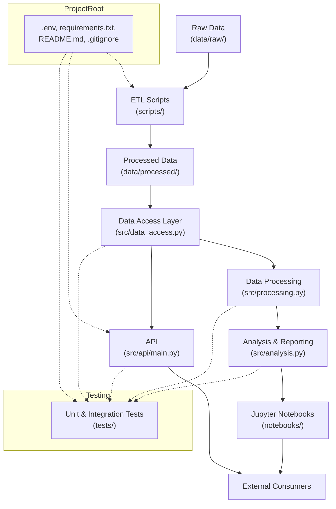

# Data Foundation Project Workflow Diagram

This document visualizes the workflow and data flow for the data foundation project using a Mermaid diagram. It illustrates how raw data is processed, accessed, analyzed, and optionally exposed via an API.

