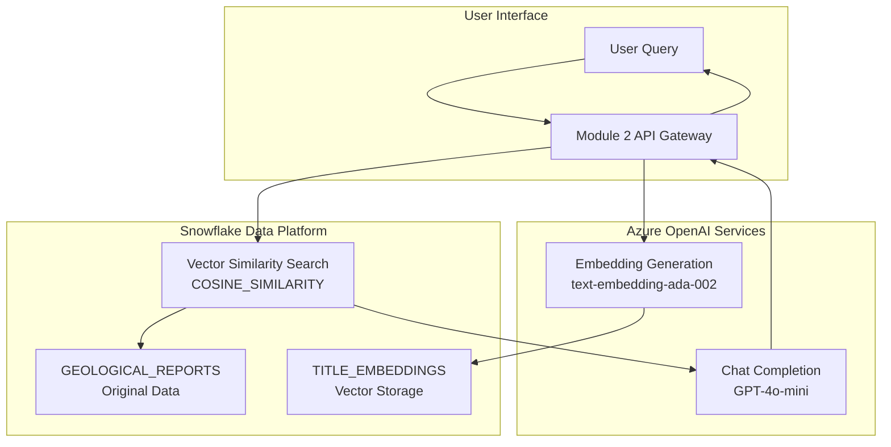
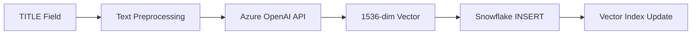
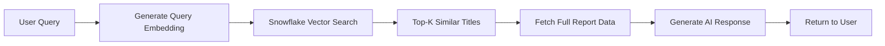

# Title-Based Embedding Implementation Plan
## Azure OpenAI + Snowflake Hybrid Architecture

---

## 📋 **Document Overview**

This document outlines the implementation plan for integrating **Azure OpenAI embeddings** with **Snowflake vector storage**, specifically using the **TITLE field** from geological reports for semantic search and retrieval.

---

## 🎯 **Architecture Strategy**

### **Core Concept**
- **Embedding Source**: TITLE field from GEOLOGICAL_REPORTS table
- **Embedding Model**: Azure OpenAI `text-embedding-ada-002` (1536 dimensions)
- **Vector Storage**: Snowflake native VECTOR data type
- **Search Method**: Snowflake VECTOR_COSINE_SIMILARITY function

### **Hybrid Benefits**
- **Azure OpenAI**: Superior embedding quality and proven performance
- **Snowflake**: Enterprise-grade vector operations and data integration
- **Single Platform**: All geological data and vectors in one system

---

## 🏗️ **Directory Structure**

```
cortex_engine/
├── src/
│   ├── __init__.py
│   ├── config.py                    # Azure + Snowflake configuration
│   ├── main.py                      # FastAPI application entry
│   ├── hybrid/                      # New hybrid implementation
│   │   ├── __init__.py
│   │   ├── azure_client.py          # Azure OpenAI integration
│   │   ├── snowflake_vector.py      # Snowflake vector operations
│   │   ├── embedding_service.py     # Embedding generation service
│   │   └── search_service.py        # Vector similarity search
│   ├── models/
│   │   ├── __init__.py
│   │   ├── embedding_models.py      # Pydantic models for embeddings
│   │   └── search_models.py         # Search request/response models
│   ├── api/
│   │   ├── __init__.py
│   │   ├── embedding_routes.py      # Embedding API endpoints
│   │   └── search_routes.py         # Search API endpoints
│   └── utils/
│       ├── __init__.py
│       ├── text_processing.py       # Title text preprocessing
│       └── batch_processing.py      # Bulk embedding operations
├── scripts/
│   ├── setup_vector_schema.py       # Snowflake schema setup
│   ├── migrate_embeddings.py        # Bulk embedding generation
│   └── test_hybrid_system.py        # System integration testing
├── tests/
│   ├── test_azure_integration.py    # Azure OpenAI tests
│   ├── test_snowflake_vectors.py    # Snowflake vector tests
│   └── test_end_to_end.py          # Complete workflow tests
└── docs/
    ├── api_documentation.md         # API endpoint documentation
    └── deployment_guide.md          # Production deployment guide
```

---

## 🔄 **Workflow Diagrams**

### **1. System Architecture Flow**



### **2. Embedding Generation Workflow**



### **3. Search & Retrieval Workflow**



---

## 📚 **Implementation Components**

### **Core Classes & Functions**

#### **1. Azure Integration (`azure_client.py`)**
```
Classes:
- AzureOpenAIClient
  - initialize_client()
  - generate_embedding()
  - generate_chat_completion()
  - validate_credentials()

Functions:
- create_azure_client()
- batch_generate_embeddings()
- handle_rate_limits()
```

#### **2. Snowflake Vector Operations (`snowflake_vector.py`)**
```
Classes:
- SnowflakeVectorStore
  - create_vector_schema()
  - store_embedding()
  - search_similar_vectors()
  - get_vector_statistics()

Functions:
- setup_vector_tables()
- bulk_insert_embeddings()
- optimize_vector_queries()
```

#### **3. Embedding Service (`embedding_service.py`)**
```
Classes:
- EmbeddingService
  - process_title()
  - generate_and_store()
  - batch_process_reports()
  - update_existing_embeddings()

Functions:
- preprocess_title_text()
- validate_embedding_quality()
- handle_embedding_errors()
```

#### **4. Search Service (`search_service.py`)**
```
Classes:
- VectorSearchService
  - semantic_search()
  - hybrid_search()
  - filter_by_metadata()
  - rank_results()

Functions:
- calculate_similarity_scores()
- apply_business_filters()
- format_search_results()
```

---

## 🚀 **Implementation Phases**

### **Phase 1: Foundation Setup**
**Objective**: Establish basic Azure + Snowflake connectivity

**Tasks**:
- [ ] Configure Azure OpenAI credentials
- [ ] Extend Snowflake schema with vector columns
- [ ] Create basic embedding generation pipeline
- [ ] Implement simple vector storage

**Deliverables**:
- Working Azure OpenAI connection
- Vector-enabled Snowflake tables
- Basic embedding API endpoint

### **Phase 2: Core Embedding Pipeline**
**Objective**: Generate embeddings for all report titles

**Tasks**:
- [ ] Implement title text preprocessing
- [ ] Create batch embedding generation
- [ ] Build vector insertion pipeline
- [ ] Add error handling and retry logic

**Deliverables**:
- All 114k+ report titles embedded
- Robust batch processing system
- Comprehensive error logging

### **Phase 3: Search Implementation**
**Objective**: Enable semantic search via vector similarity

**Tasks**:
- [ ] Implement vector similarity search
- [ ] Create search API endpoints
- [ ] Add result filtering and ranking
- [ ] Integrate with existing Module 1 data

**Deliverables**:
- Fast semantic search functionality
- RESTful search API
- Integration with geological data

### **Phase 4: AI Response Generation**
**Objective**: Complete RAG pipeline with contextual responses

**Tasks**:
- [ ] Implement context assembly
- [ ] Create chat completion pipeline
- [ ] Add response quality validation
- [ ] Build conversation memory

**Deliverables**:
- Full RAG system operational
- High-quality AI responses
- Conversation continuity

---

## 🎛️ **API Endpoints Design**

### **Embedding Management**
```
POST /embeddings/generate
POST /embeddings/batch-process
GET  /embeddings/status/{job_id}
PUT  /embeddings/refresh/{report_id}
```

### **Vector Search**
```
POST /search/semantic
POST /search/hybrid
GET  /search/similar/{report_id}
GET  /search/statistics
```

### **System Operations**
```
GET  /health/hybrid
GET  /metrics/embeddings
POST /admin/reindex
GET  /admin/vector-stats
```

---

## 📊 **Performance Targets**

### **Embedding Generation**
- **Batch Processing**: 1,000 titles per hour
- **Individual Embedding**: <2 seconds per title
- **Error Rate**: <0.1% failures

### **Search Performance**
- **Query Response**: <200ms for similarity search
- **Throughput**: 100+ concurrent searches
- **Accuracy**: >85% relevant results in top-5

### **System Reliability**
- **Uptime**: 99.9% availability
- **Data Consistency**: 100% vector-data alignment
- **Recovery Time**: <5 minutes for system restart

---

## 🔧 **Technical Considerations**

### **Title Field Characteristics**
- **Content Type**: Report titles and project names
- **Length Range**: 10-200 characters typically
- **Language**: Professional geological terminology
- **Uniqueness**: High variability across reports

### **Embedding Strategy**
- **Preprocessing**: Standardize geological terms
- **Enhancement**: Add metadata context if needed
- **Quality**: Validate embedding relevance
- **Updates**: Incremental processing for new reports

### **Vector Storage Optimization**
- **Indexing**: Leverage Snowflake's native vector optimization
- **Partitioning**: Consider temporal or geographic partitioning
- **Backup**: Ensure vector data durability
- **Monitoring**: Track vector quality metrics

---

## 🎯 **Success Metrics**

### **Technical Success**
- [ ] All 114k+ titles successfully embedded
- [ ] Sub-200ms search response times
- [ ] Zero data loss during migration
- [ ] 99.9% system uptime

### **Business Success**
- [ ] Relevant search results for geological queries
- [ ] Faster information discovery vs. keyword search
- [ ] Reduced time-to-insight for geological research
- [ ] Seamless integration with existing workflows

This implementation plan provides a clear roadmap for building a production-ready hybrid AI system that leverages the best of both Azure OpenAI and Snowflake platforms while maintaining simplicity and reliability. 